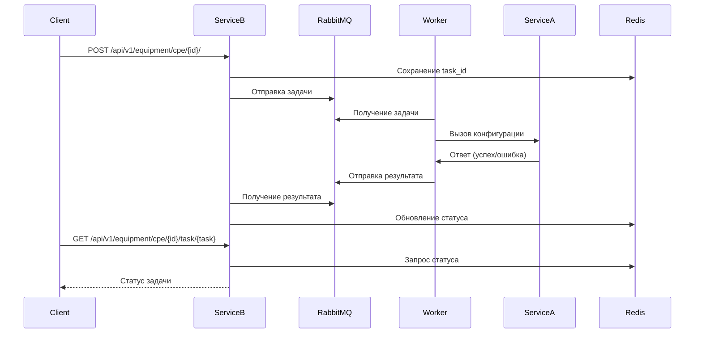

```markdown
# 🛠 ToyConfigurator – Асинхронная система конфигурации оборудования

## 🚀 Описание проекта
**ToyConfigurator** — это асинхронный сервис для активации и конфигурации оборудования.  
Проект состоит из **трёх основных компонентов**:

1. **Сервис A** – Синхронный сервис конфигурации (заглушка), закрытый для изменения.
2. **Сервис B** – Асинхронный frontend-сервис, обеспечивающий:
   - Приём запросов на активацию оборудования.
   - Создание задач и отправку их в очередь RabbitMQ.
   - Получение фактического статуса задач.
3. **Скрипт обработки задач** – Подписывается на очередь, вызывает сервис A и отправляет результат в RabbitMQ.

---

## ⚡ Быстрый старт

### 🔹 Установка и запуск Redis (WSL)
```sh
wsl --install
sudo apt update && sudo apt install redis -y
redis-server
```

### 🔹 Установка и запуск RabbitMQ (Windows)
Скачайте и установите [RabbitMQ](https://www.rabbitmq.com/download.html).  
После установки запустите сервер:
```sh
.\rabbitmq-server.bat
```

### 🔹 Запуск сервисов
```sh
python ServiceA/main.py  # Запуск сервиса A
python ServiceB/main.py  # Запуск сервиса B
python Adapter/main.py    # Запуск обработчика задач
```

---

## 🔄 Схема работы

### 🏗 Архитектура
1. **Клиент** отправляет запрос `POST /api/v1/equipment/cpe/{id}/activate` в **Сервис B**.
2. **Сервис B** генерирует `task_id`, сохраняет данные в Redis и отправляет сообщение в RabbitMQ.
3. **Обработчик задач** подписан на очередь RabbitMQ, получает задачу и вызывает **Сервис A**.
4. **Сервис A** выполняет конфигурацию и отправляет результат в очередь.
5. **Сервис B** подписан на очередь результатов, обновляет статус задачи в Redis.
6. Клиент запрашивает статус задачи через `GET /api/v1/equipment/cpe/{id}/task/{task}`.

### 🔄 Диаграмма взаимодействия:


---

## 📌 API эндпоинты

### 🎯 Запрос на активацию оборудования
```http
POST /api/v1/equipment/cpe/{id}/
```
**Ответ:**
```json
{
  "code": 200,
  "task_id": "unique_task_id"
}
```

### 📌 Получение статуса задачи
```http
GET /api/v1/equipment/cpe/{id}/task/{task}
```
#### ✅ Возможные ответы:
| Код | Сообщение                   | Описание                                     |
|-----|-----------------------------|----------------------------------------------|
| 200 | "Completed"                  | Задача выполнена успешно                    |
| 204 | "Task is still running"       | Задача всё ещё выполняется                  |
| 500 | "Internal provisioning exception" | Внутренняя ошибка сервиса                   |
| 404 | "The requested equipment is not found" | Устройство не найдено                     |
| 404 | "The requested task is not found" | Задача не найдена                          |

---

## 🔧 Технологии
- **FastAPI** – HTTP-сервис
- **Redis** – Хранение состояний задач
- **RabbitMQ** – Очереди сообщений
- **aiohttp** – Асинхронные HTTP-запросы
- **aio_pika** – RabbitMQ клиент
- **asyncio** – Асинхронное выполнение задач

---
